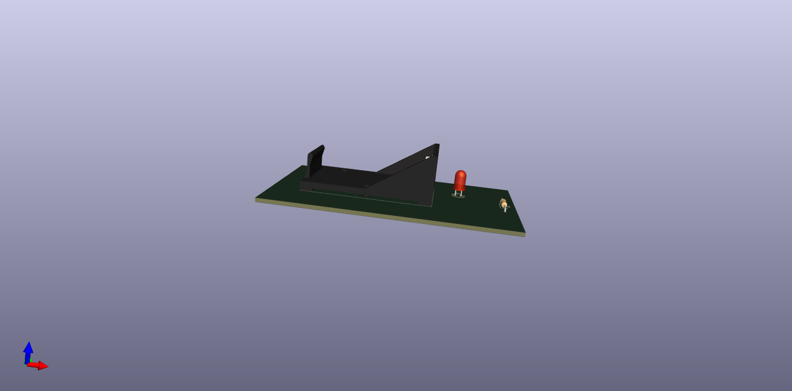
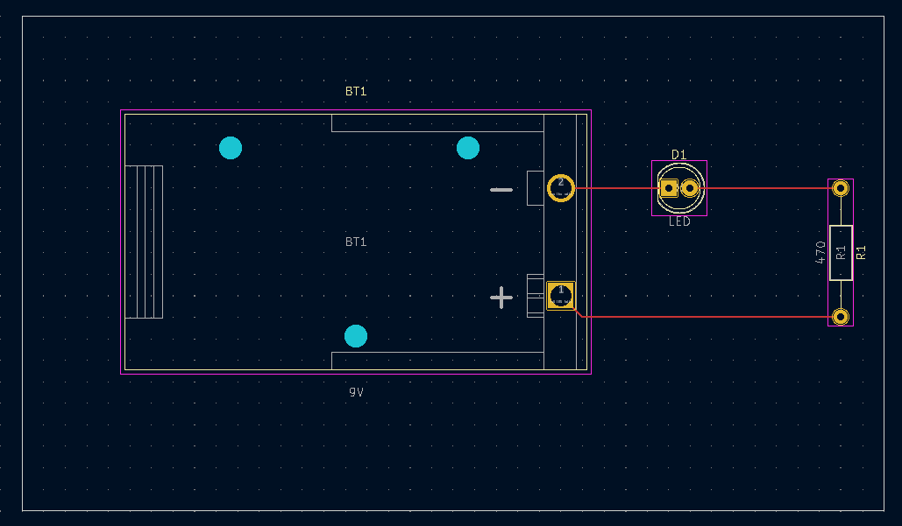
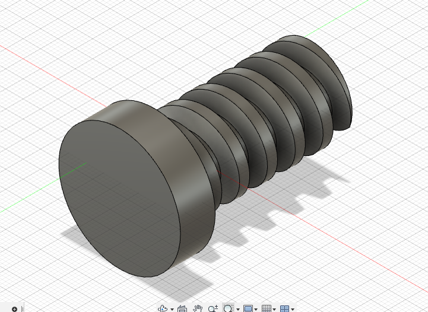
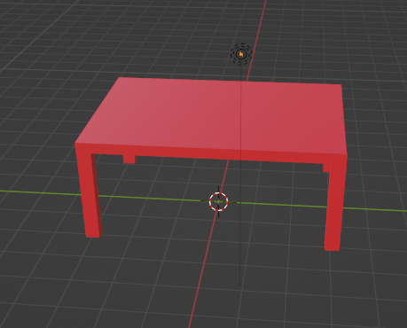
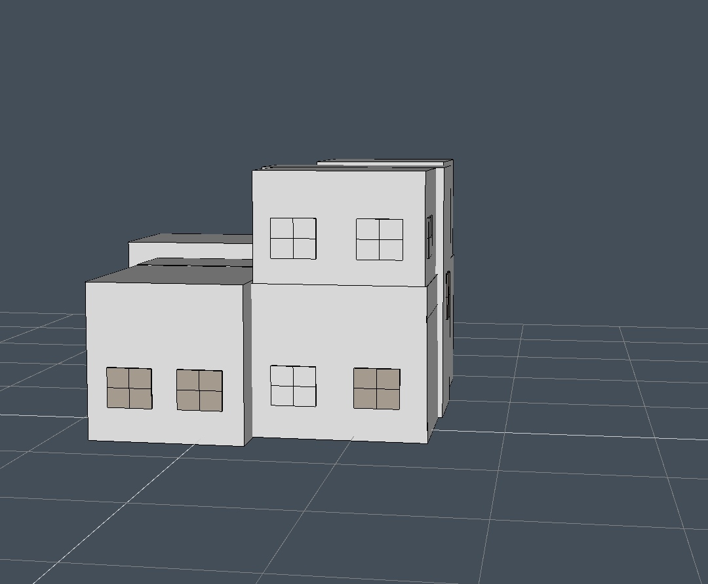
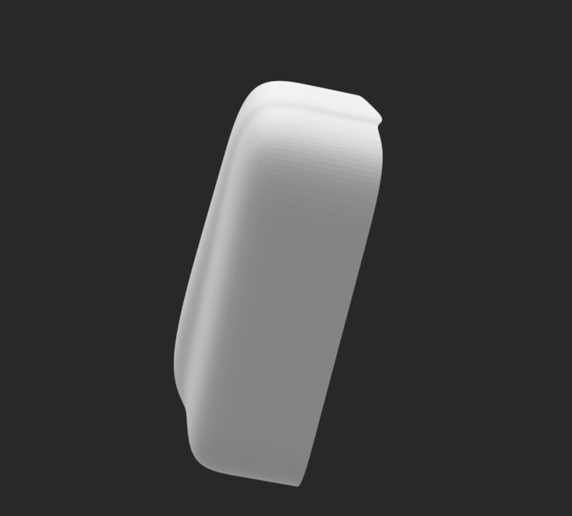

# 3d

## prototyping various models for fabrication in my projects

### pcb

|pcb1 |pcb1 (layout)|
|:----:|:----:|
|||
|board|kicad|
|3d|circuit|

### screw and table

|screw |table|
|:----:|:----:|
|||
|fusion 360|blender|

### house & case

|house |case|
|:----:|:----:|
|||
|app|fusion 360|
|planing our house for renovation|plastic case for modem|
